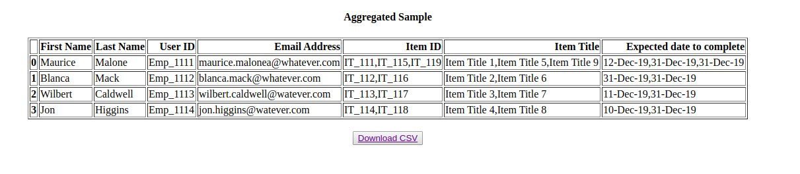

#### About :

Flask App for 2 common csv tranformation at work

<h5> ** Delimiter : Comma is the default delimiter ** <h5>

1. Aggregation of columns with respect to a group by column.
2. Splitting aggregated columns.

#### Requirements

1. Python 3
2. pip3

#### Run Procedure

1. Download Project
2. Extract
3. Navigate terminal to project location
4. command : source venv/bin/activate
5. Run `pip3 install -r requirements.txt`
6. Run `python3 ff.py`
7. Access <a href="http://localhost:5000">localhost:5000</a>
8. You should see

#### Walkthrough
##### 1. Aggregation Scenario: Find CSV structure for aggregating under `sample_files/blog_data.csv`

##### 2. Split Scenario: Find CSV structure for splitting under `sample_files/aggregated.csv`

